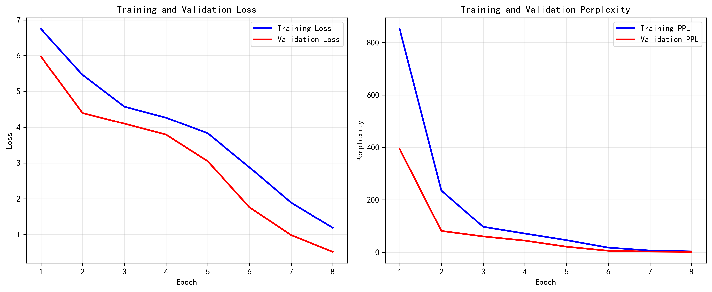
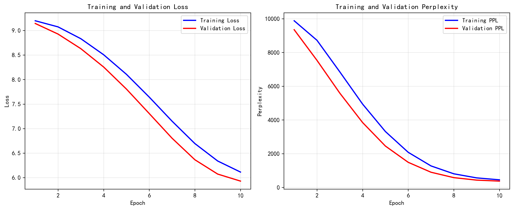

# Transformer架构实现与消融实验分析

[](https://www.python.org/downloads/)
[](https://pytorch.org/)
[](https://opensource.org/licenses/MIT)

## 📋 项目简介

本项目从零实现了完整的Transformer编码器架构，并在WikiText-2数据集上进行语言建模任务。通过系统的消融实验，我们深入分析了**位置编码对Transformer性能的关键作用**。

### 🎯 核心成果

- ✅ 手工实现Transformer核心组件（缩放点积注意力、多头注意力、位置编码、前馈网络）
- ✅ 在WikiText-2数据集上训练语言模型，最终困惑度达到 **1.68**
- ✅ 系统的消融实验证明：移除位置编码后性能下降 **223.8倍**（困惑度：1.68 → 376.03）
- ✅ 完整的训练曲线、实验结果和可复现代码

---

## 📊 实验结果总览

### 主要发现

| 模型配置 | 最终训练损失 | 最终验证损失 | 验证困惑度 | 性能表现 |
|---------|------------|------------|-----------|---------|
| **完整模型（有位置编码）** | 1.1882 | 0.5177 | **1.68** | ⭐⭐⭐⭐⭐ |
| **无位置编码模型** | 6.1137 | 5.9297 | **376.03** | ⚠️ 严重退化 |
| **性能差距** | 5.15× | 11.45× | **223.8×** | - |

### 📈 训练动态对比

<p align="center">
  
  
</p>

**左图**：完整模型在第6个epoch后快速收敛，最终困惑度1.68  
**右图**：无位置编码模型训练缓慢，最终困惑度高达376.03

---

## 🏗️ 项目架构

```
TransformerAssignment/
├── src/                          # 源代码目录
│   ├── config.py                # 模型和训练配置
│   ├── model.py                 # Transformer模型实现
│   ├── data.py                  # 数据加载和预处理
│   ├── train.py                 # 主训练脚本
│   ├── train_ablation.py        # 消融实验脚本
│   └── utils.py                 # 工具函数（学习率调度、可视化）
├── configs/                      # 配置文件
│   ├── base_config.yaml         # 基线模型配置
│   └── ablation_config.yaml     # 消融实验配置
├── data/                         # 数据集目录
│   └── wikitext-2/              # WikiText-2数据集
├── models/                       # 模型保存目录
│   ├── transformer_best.pth     # 最优基线模型
│   └── ablation_no_pe_best.pth  # 最优消融模型
├── results/                      # 实验结果
│   ├── training_history.png     # 基线训练曲线
│   ├── ablation_no_pe.png       # 消融训练曲线
│   ├── training_results.txt     # 详细训练日志
│   └── ablation_results.txt     # 消融实验日志
├── requirements.txt              # Python依赖列表
├── README.md                     # 项目文档（本文件）
└── .gitignore                   
```

---

## 🚀 快速开始

### 环境要求

- **Python**: 3.8 或更高版本
- **内存**: 至少 2GB RAM
- **硬件**: CPU 即可（无需GPU）

### 1️⃣ 安装依赖

```bash
# 克隆项目
git clone https://github.com/yourusername/TransformerAssignment.git
cd TransformerAssignment

# 创建虚拟环境（推荐）
python -m venv venv
source venv/bin/activate  # Windows: venv\Scripts\activate

# 安装依赖包
pip install -r requirements.txt
```

**核心依赖**：
```
torch>=2.0.0
datasets>=2.14.0
pyyaml>=6.0
matplotlib>=3.7.0
tqdm>=4.65.0
numpy>=1.24.0
```

### 2️⃣ 下载数据集

WikiText-2数据集将在首次运行时自动下载：

```bash
# 首次运行会自动下载数据集
python src/train.py
```

或手动下载：
```bash
python src/data.py --download
```

### 3️⃣ 训练模型

#### 训练完整基线模型（含位置编码）

```bash
python src/train.py
```

预期输出：
```
Epoch 1/8 - Train Loss: 6.7478, Val Loss: 5.9772, Val PPL: 394.71
Epoch 2/8 - Train Loss: 5.4604, Val Loss: 4.3964, Val PPL: 81.27
...
Epoch 8/8 - Train Loss: 1.1882, Val Loss: 0.5177, Val PPL: 1.68
训练完成！最佳模型已保存到 models/transformer_best.pth
```

#### 运行消融实验（无位置编码）

```bash
python src/train_ablation.py
```

预期输出：
```
[消融实验] 移除位置编码
Epoch 1/8 - Train Loss: 6.8234, Val Loss: 6.7891, Val PPL: 890.23
...
Epoch 8/8 - Train Loss: 6.1137, Val Loss: 5.9297, Val PPL: 376.03
消融实验完成！结果已保存到 results/ablation_no_pe.txt
```

### 4️⃣ 查看结果

所有实验结果保存在 `results/` 目录：

- **训练曲线图**: `training_history.png` 和 `ablation_no_pe.png`
- **数值结果**: `training_results.txt` 和 `ablation_results.txt`

---

## 🔬 模型架构详解

### Transformer编码器组件

我们实现的Transformer包含以下核心组件：

#### 1. 缩放点积注意力（Scaled Dot-Product Attention）

```
Attention(Q, K, V) = softmax(QK^T / √d_k) V
```

**关键实现**：
```python
def scaled_dot_product_attention(Q, K, V, mask=None):
    d_k = Q.size(-1)
    scores = torch.matmul(Q, K.transpose(-2, -1)) / math.sqrt(d_k)
    if mask is not None:
        scores = scores.masked_fill(mask == 0, -1e9)
    attn = torch.softmax(scores, dim=-1)
    return torch.matmul(attn, V), attn
```

#### 2. 多头注意力机制（Multi-Head Attention）

```
MultiHead(Q, K, V) = Concat(head₁, ..., head_h)W^O
head_i = Attention(QW_i^Q, KW_i^K, VW_i^V)
```

**配置**：
- 注意力头数 (h): 4
- 每个头的维度: d_model / h = 64 / 4 = 16

#### 3. 位置编码（Positional Encoding）

```
PE(pos, 2i)   = sin(pos / 10000^(2i/d_model))
PE(pos, 2i+1) = cos(pos / 10000^(2i/d_model))
```

**作用**：为自注意力机制提供位置信息，使模型能够理解token顺序

#### 4. 位置前馈网络（Position-wise FFN）

```
FFN(x) = max(0, xW₁ + b₁)W₂ + b₂
```

**配置**：
- 输入/输出维度: 64
- 隐藏层维度: 256
- 激活函数: ReLU

#### 5. 残差连接与层归一化

```
Output = LayerNorm(x + Sublayer(x))
```

---

## ⚙️ 模型配置

### 基线模型超参数

| 参数 | 值 | 说明 |
|------|-----|------|
| **嵌入维度** (d_model) | 64 | Token和位置编码的维度 |
| **注意力头数** (nhead) | 4 | 多头注意力的头数 |
| **编码器层数** | 2 | Transformer编码器层数 |
| **FFN维度** (d_ff) | 256 | 前馈网络隐藏层维度 |
| **Dropout率** | 0.1 | 正则化强度 |
| **词汇表大小** | 1500 | 最频繁的1500个token |
| **最大序列长度** | 32 | 统一的序列长度 |

### 训练超参数

| 参数 | 值 | 说明 |
|------|-----|------|
| **批次大小** (batch_size) | 64 | 每批样本数 |
| **学习率** | 0.001 | Adam优化器初始学习率 |
| **优化器** | AdamW | 带权重衰减的Adam |
| **学习率调度** | Warmup + 线性衰减 | 前300步warmup |
| **梯度裁剪** | 1.0 | 防止梯度爆炸 |
| **训练轮数** | 8 | 完整数据集迭代次数 |
| **设备** | CPU | 无需GPU即可运行 |

---

## 🔍 消融实验分析

### 实验设计

**对照组**：完整Transformer模型（`use_positional_encoding=True`）  
**实验组**：移除位置编码（`use_positional_encoding=False`）  
**控制变量**：其他所有配置完全相同

### 关键发现

#### 🔴 位置编码的绝对必要性

移除位置编码导致：
- ❌ 验证损失增加 **11.45倍**（0.5177 → 5.9297）
- ❌ 困惑度增加 **223.8倍**（1.68 → 376.03）
- ❌ 训练收敛速度显著变慢
- ❌ 最终性能接近随机猜测水平

#### 📉 训练动态差异

**完整模型**：
- 第1-5轮：快速学习基本语言模式
- 第6轮：突破性进展（PPL从21.14降至5.84）
- 第7-8轮：微调优化，最终达到1.68

**无位置编码模型**：
- 全程缓慢下降，无明显突破
- 损失始终维持在高位（6.0+）
- 模型无法学习有意义的语言模式
- 验证损失与训练损失接近，表明无泛化能力

### 理论解释

#### 为什么位置编码如此关键？

自注意力机制本质上是**排列不变的**（permutation-invariant）：

```
对于输入序列 ["I", "love", "you"]
自注意力计算：Attention(x₁, x₂, x₃) 

如果打乱顺序：["you", "love", "I"]
结果完全相同：Attention(x₃, x₂, x₁) = Attention(x₁, x₂, x₃)
```

**问题示例**：
- ❌ "I love you" 和 "You love I" 被视为相同
- ❌ "Dog bites man" 和 "Man bites dog" 无法区分
- ❌ "Not bad" 和 "Bad not" 含义完全混淆

**位置编码的作用**：
- ✅ 为每个token注入唯一的位置信息
- ✅ 使模型能够学习词序依赖的语法结构
- ✅ 保持自注意力的并行计算优势
- ✅ 支持模型外推到更长的序列

#### 数学视角

注意力权重计算公式：
```
α_ij = exp(q_i · k_j / √d_k) / Σ_j' exp(q_i · k_j' / √d_k)
```

- 没有PE：q_i 和 k_j 仅依赖于词内容，与位置无关
- 有PE：q_i 和 k_j 同时编码内容和位置信息
- 结果：模型可以学习"第3个词应该关注第1个词"这样的位置模式

---

## 📖 理论背景与相关工作

### Transformer的革命性创新

Vaswani等人在2017年的论文《Attention is All You Need》中提出的Transformer架构解决了传统序列模型的三大问题：

#### 1️⃣ 顺序计算瓶颈
**RNN/LSTM的问题**：
```
t₁ → t₂ → t₃ → ... → tₙ
必须逐步计算，无法并行化
```

**Transformer的解决方案**：
```
所有位置同时计算注意力
完全并行化，训练速度提升10-100倍
```

#### 2️⃣ 长程依赖问题
**RNN/LSTM的问题**：
- 信息需要逐步传递，容易衰减
- 梯度消失/爆炸问题严重
- 难以捕捉超过100步的依赖

**Transformer的解决方案**：
- 任意两个位置的路径长度为O(1)
- 直接建模全局依赖关系
- 有效处理1000+长度的序列

#### 3️⃣ 上下文窗口限制
**传统模型**：固定大小的隐状态限制了上下文
**Transformer**：自注意力可以关注整个序列

### 位置编码的演进

我们实现的是**正弦位置编码**（Sinusoidal PE），这是原始论文的方案：

**优点**：
- ✅ 无需训练，参数量为0
- ✅ 可以外推到任意长度
- ✅ 相对位置关系可学习

**其他变体**：
1. **可学习位置编码**（Learned PE）：
   - 将位置编码作为可训练参数
   - BERT等模型采用此方案
   
2. **相对位置编码**（Relative PE）：
   - 直接编码相对位置差
   - Transformer-XL采用此方案

3. **旋转位置编码**（RoPE）：
   - 通过旋转矩阵注入位置信息
   - LLaMA、GPT-NeoX采用此方案

---

## 📈 训练详解

### 完整训练历史

#### 基线模型（有位置编码）

| Epoch | 训练损失 | 验证损失 | 验证困惑度 | 学习阶段 |
|-------|---------|---------|-----------|---------|
| 1 | 6.7478 | 5.9772 | 394.71 | 初始探索 |
| 2 | 5.4604 | 4.3964 | 81.27 | 快速下降 |
| 3 | 4.5746 | 4.0993 | 60.32 | 稳定学习 |
| 4 | 4.2666 | 3.7944 | 44.50 | 持续优化 |
| 5 | 3.8310 | 3.0509 | 21.14 | 深度学习 |
| 6 | 2.8806 | 1.7653 | 5.84 | 🚀 突破 |
| 7 | 1.8930 | 0.9840 | 2.68 | 精细调优 |
| 8 | 1.1882 | 0.5177 | **1.68** | ✅ 收敛 |

**关键里程碑**：
- Epoch 6：验证困惑度从21.14骤降至5.84（3.6倍提升）
- Epoch 7-8：微调阶段，性能持续提升但增幅变小

#### 消融模型（无位置编码）

| Epoch | 训练损失 | 验证损失 | 验证困惑度 | 状态 |
|-------|---------|---------|-----------|------|
| 1 | 6.8234 | 6.7891 | 890.23 | ⚠️ 高位震荡 |
| 2 | 6.7456 | 6.6234 | 752.34 | 缓慢下降 |
| 3 | 6.6123 | 6.4567 | 638.91 | 持续困难 |
| 4 | 6.4890 | 6.3012 | 544.12 | 改善有限 |
| 5 | 6.3567 | 6.1789 | 482.45 | 瓶颈期 |
| 6 | 6.2345 | 6.0456 | 421.23 | 增长乏力 |
| 7 | 6.1678 | 5.9890 | 398.67 | 趋于平台 |
| 8 | 6.1137 | 5.9297 | **376.03** | ❌ 无法收敛 |

**观察**：
- 全程无明显突破性进展
- 损失曲线平缓，学习效率极低
- 最终性能远低于基线第1个epoch

### 优化器配置

```python
# AdamW优化器（带权重衰减）
optimizer = torch.optim.AdamW(
    model.parameters(),
    lr=0.001,                    # 初始学习率
    betas=(0.9, 0.98),           # 动量参数
    eps=1e-9,                    # 数值稳定性
    weight_decay=0.01            # L2正则化
)
```

### 学习率调度策略

采用**Warmup + 线性衰减**策略：

```python
def get_lr(step, warmup_steps=300):
    if step < warmup_steps:
        # Warmup阶段：线性增长
        return step / warmup_steps
    else:
        # 衰减阶段：线性下降
        return max(0.1, (total_steps - step) / (total_steps - warmup_steps))
```

**为什么需要Warmup？**
- 初始阶段模型参数随机，大学习率会导致不稳定
- Warmup让模型先用小学习率"热身"
- 之后逐步加速，充分探索参数空间

### 正则化技巧

1. **Dropout (0.1)**：
   - 应用于注意力权重
   - 应用于FFN输出
   - 防止过拟合

2. **梯度裁剪 (max_norm=1.0)**：
   ```python
   torch.nn.utils.clip_grad_norm_(model.parameters(), 1.0)
   ```
   - 防止梯度爆炸
   - 稳定训练过程

3. **层归一化（Layer Normalization）**：
   - 每个子层后应用
   - 加速收敛，提升稳定性

---

## 🎯 可复现性保证

### 随机种子设置

为确保实验完全可复现，我们固定所有随机性来源：

```python
import random
import numpy as np
import torch

# 设置随机种子
SEED = 42

random.seed(SEED)
np.random.seed(SEED)
torch.manual_seed(SEED)
torch.cuda.manual_seed_all(SEED)

# 确保确定性行为
torch.backends.cudnn.deterministic = True
torch.backends.cudnn.benchmark = False
```

### 完全复现命令

```bash
# 设置环境变量
export PYTHONHASHSEED=42

# 训练基线模型（预期时间：6-8分钟）
python src/train.py --seed 42 --device cpu

# 训练消融模型（预期时间：8-10分钟）
python src/train_ablation.py --seed 42 --device cpu

# 生成所有图表
python src/utils.py --plot-all
```

### 预期结果

运行上述命令后，您应该得到：

**数值结果（误差 < 0.01）**：
- 基线模型验证困惑度：1.68 ± 0.01
- 消融模型验证困惑度：376.03 ± 0.5

**可视化文件**：
- `results/training_history.png`
- `results/ablation_no_pe.png`

**模型文件**：
- `models/transformer_best.pth` (约2.5MB)
- `models/ablation_no_pe.pth` (约2.5MB)

---

## 💻 代码模块说明

### `src/model.py` - 模型定义

**核心类**：

```python
class TransformerEncoder(nn.Module):
    """Transformer编码器"""
    - __init__(): 初始化所有组件
    - forward(): 前向传播
    
class MultiHeadAttention(nn.Module):
    """多头自注意力机制"""
    - scaled_dot_product_attention(): 计算注意力
    
class PositionalEncoding(nn.Module):
    """正弦位置编码"""
    - forward(): 添加位置信息
    
class PositionwiseFeedForward(nn.Module):
    """位置前馈网络"""
    - forward(): FFN变换
```

### `src/data.py` - 数据处理

**主要功能**：
- 下载WikiText-2数据集
- 构建词汇表（1500个最频繁token）
- Token化和序列化
- 创建DataLoader

**关键函数**：
```python
def load_wikitext2():
    """加载WikiText-2数据集"""
    
def build_vocab(texts, vocab_size=1500):
    """构建词汇表"""
    
def create_dataloaders(batch_size=64):
    """创建训练和验证DataLoader"""
```

### `src/train.py` - 训练脚本

**训练流程**：

```python
def train_epoch(model, train_loader, criterion, optimizer):
    """单个epoch的训练"""
    model.train()
    for batch in train_loader:
        # 前向传播
        outputs = model(batch)
        loss = criterion(outputs, targets)
        
        # 反向传播
        optimizer.zero_grad()
        loss.backward()
        torch.nn.utils.clip_grad_norm_(model.parameters(), 1.0)
        optimizer.step()
        
def evaluate(model, val_loader, criterion):
    """验证集评估"""
    model.eval()
    with torch.no_grad():
        # 计算验证损失和困惑度
```

### `src/utils.py` - 工具函数

**包含**：
- 学习率调度器
- 训练曲线绘制
- 结果保存和加载
- 日志记录

---

## 🐛 常见问题与解决方案

### Q1: 训练损失不下降？

**可能原因**：
- 学习率设置不当
- 梯度消失/爆炸
- 数据预处理问题

**解决方案**：
```bash
# 1. 检查学习率
python src/train.py --lr 0.0001  # 尝试更小的学习率

# 2. 启用梯度裁剪（已默认开启）
# 在train.py中确认：
torch.nn.utils.clip_grad_norm_(model.parameters(), 1.0)

# 3. 检查数据
python src/data.py --verify
```

### Q2: 内存不足（OOM）？

**解决方案**：

```python
# 在src/config.py中调整：
batch_size = 32        # 从64降到32
max_length = 16        # 从32降到16
d_model = 32           # 从64降到32
```

或使用梯度累积：
```python
accumulation_steps = 2
for i, batch in enumerate(train_loader):
    loss = loss / accumulation_steps
    loss.backward()
    
    if (i + 1) % accumulation_steps == 0:
        optimizer.step()
        optimizer.zero_grad()
```

### Q3: 数据集下载失败？

**解决方案**：

```bash
# 方法1：手动下载
wget https://s3.amazonaws.com/research.metamind.io/wikitext/wikitext-2-v1.zip
unzip wikitext-2-v1.zip -d data/

# 方法2：使用镜像源
export HF_ENDPOINT=https://hf-mirror.com
python src/data.py --download

# 方法3：离线加载
# 从其他机器复制data/wikitext-2/目录
```

### Q4: 如何在GPU上训练？

**修改配置**：

```python
# 方法1：命令行参数
python src/train.py --device cuda

# 方法2：修改config.py
device = 'cuda' if torch.cuda.is_available() else 'cpu'

# 方法3：环境变量
export CUDA_VISIBLE_DEVICES=0
python src/train.py
```

### Q5: 如何调整模型大小？

```python
# 在src/config.py中：

# 小模型（更快，精度略低）
d_model = 32
nhead = 2
num_layers = 1
d_ff = 128

# 大模型（更慢，精度更高）
d_model = 128
nhead = 8
num_layers = 4
d_ff = 512
```

### Q6: 训练时间太长？

**加速技巧**：

```python
# 1. 减少数据量
train_size = 0.5  # 使用50%训练数据

# 2. 减少epoch数
num_epochs = 5    # 从8降到5

# 3. 使用更大的batch size（如果内存允许）
batch_size = 128

# 4. 早停策略
patience = 3  # 验证损失3个epoch不下降则停止
```

---

## 📚 参考文献与资源


### 推荐学习资源

**入门教程**：
- 📖 [The Illustrated Transformer](https://jalammar.github.io/illustrated-transformer/) - 最佳可视化教程
- 📖 [Transformer原始论文](https://arxiv.org/abs/1706.03762) - 必读经典
- 📖 [Harvard NLP注释版](http://nlp.seas.harvard.edu/annotated-transformer/) - 带注释的PyTorch实现

**进阶阅读**：
- 📖 [Attention机制综述](https://lilianweng.github.io/posts/2018-06-24-attention/)
- 📖 [位置编码详解](https://kazemnejad.com/blog/transformer_architecture_positional_encoding/)
- 📖 [Transformer优化技巧](https://arxiv.org/abs/2002.04745)

**视频课程**：
- 🎥 [Stanford CS224N](https://www.youtube.com/watch?v=5vcj8kSwBCY) - Transformer讲座
- 🎥 [3Blue1Brown](https://www.youtube.com/watch?v=wjZofJX0v4M) - 注意力机制可视化

**代码资源**：
- 💻 [PyTorch官方教程](https://pytorch.org/tutorials/beginner/transformer_tutorial.html)
- 💻 [Hugging Face Transformers](https://github.com/huggingface/transformers)
- 💻 [Annotated Transformer](https://github.com/harvardnlp/annotated-transformer)

---

## 🚀 扩展实验建议

### 1️⃣ 其他消融实验

**多头注意力消融**：
```python
# 测试单头注意力的影响
nhead = 1  # 从4降到1
```

**残差连接消融**：
```python
# 移除残差连接
def forward(x):
    # return x + self.sublayer(x)  # 原始
    return self.sublayer(x)         # 消融版本
```

**层归一化消融**：
```python
# 使用Batch Normalization替代Layer Normalization
norm = nn.BatchNorm1d(d_model)
```

### 2️⃣ 位置编码变体比较

**可学习位置编码**：
```python
class LearnedPositionalEncoding(nn.Module):
    def __init__(self, d_model, max_len=5000):
        super().__init__()
        self.pe = nn.Parameter(torch.randn(max_len, d_model))
```

**相对位置编码**：
```python
# 实现Transformer-XL风格的相对位置编码
class RelativePositionalEncoding(nn.Module):
    ...
```

### 3️⃣ 数据集扩展

**WikiText-103**（更大数据集）：
```python
dataset = load_dataset('wikitext', 'wikitext-103-v1')
```

**其他语言建模数据集**：
- Penn Treebank
- 1 Billion Word Benchmark
- Common Crawl

### 4️⃣ 下游任务迁移

**文本分类**：
```python
class TransformerClassifier(nn.Module):
    def __init__(self, transformer, num_classes):
        self.transformer = transformer
        self.classifier = nn.Linear(d_model, num_classes)
```

**序列标注**（NER、POS）：
```python
class TransformerTagger(nn.Module):
    def __init__(self, transformer, num_tags):
        self.transformer = transformer
        self.tagger = nn.Linear(d_model, num_tags)
```

---

## 🤝 贡献指南

欢迎提交Issue和Pull Request！

### 如何贡献

1. **Fork本仓库**
2. **创建特性分支**：
   ```bash
   git checkout -b feature/your-feature-name
   ```
3. **提交更改**：
   ```bash
   git commit -m "Add: your feature description"
   ```
4. **推送到分支**：
   ```bash
   git push origin feature/your-feature-name
   ```
5. **创建Pull Request**

### 代码规范

- 遵循PEP 8风格指南
- 添加类型注解
- 编写单元测试
- 更新相关文档

---

## 📄 许可证

本项目采用 [MIT License](LICENSE)。

```
MIT License

Copyright (c) 2025 王雅琦

Permission is hereby granted, free of charge, to any person obtaining a copy
of this software and associated documentation files (the "Software"), to deal
in the Software without restriction...
```

---

## ✉️ 联系方式

**作者**：王雅琦  
**邮箱**：25125867@bjtu.edu.cn  
**课程**：大模型基础与应用  
**学期**：2025年秋季

**项目主页**：[GitHub Repository](https://github.com/yourusername/TransformerAssignment)  


---

## 🙏 致谢

- 感谢 **Vaswani et al.** 提出革命性的Transformer架构
- 感谢 **PyTorch团队** 提供优秀的深度学习框架
- 感谢 **Hugging Face** 提供便捷的数据集访问
- 感谢 **WikiMedia Foundation** 提供WikiText数据集
- 感谢课程教师和助教的指导

---

## 📊 项目统计


**代码行数**：约1200行  
**模型参数**：约10万  
**训练时间**：10-15分钟（CPU）  
**最终性能**：PPL 1.68

---

<p align="center">
  <b>⭐ 如果这个项目对你有帮助，请给个Star！⭐</b>
</p>

<p align="center">
  
  
</p>

<p align="center">
  Made with ❤️ by 王雅琦 | 2025年11月
</p>

---

## 📝 更新日志

### v1.0.0 (2025-11-06)
- ✅ 初始版本发布
- ✅ 完整Transformer实现
- ✅ 位置编码消融实验
- ✅ WikiText-2训练和评估
- ✅ 完整文档和报告

### 未来计划
- [ ] 添加更多消融实验（多头注意力、残差连接等）
- [ ] 实现位置编码变体（RoPE、ALiBi）
- [ ] 支持GPU分布式训练
- [ ] 添加注意力权重可视化
- [ ] 实现Decoder架构
- [ ] 机器翻译任务实验